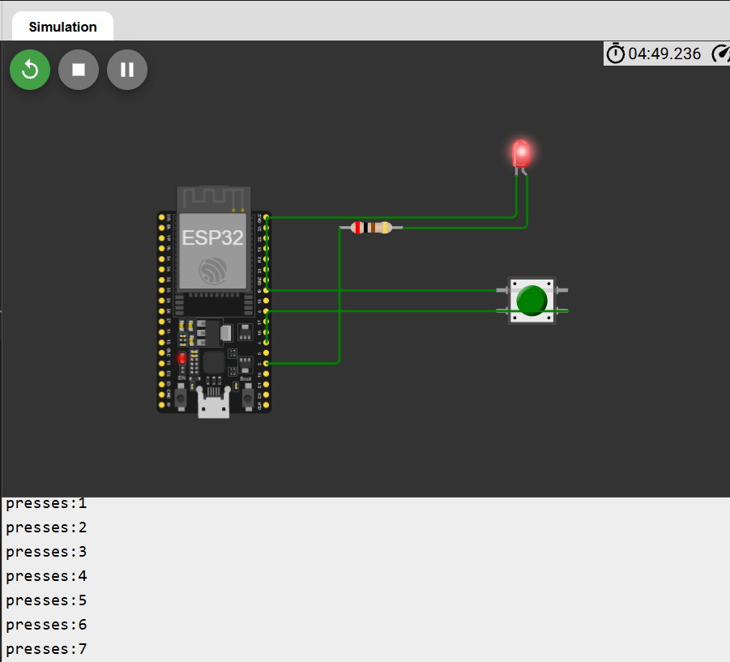

# 01-button-led: button, LED and interrupt on ESP32

A small embedded project built in the [Wokwi](https://wokwi.com) simulator with an ESP32 and the Arduino framework. Each press of a push button toggles an LED and prints the number of presses on the serial monitor. The button is read with an interrupt, and its bounce is filtered in two steps.

## What it does

- Press the button: the LED switches on, press again: it switches off.
- The serial monitor shows `presses:1`, `presses:2`, and so on.
- The main loop is free to do other work, because the button is handled by an interrupt and not by polling.

## Circuit

| From | Through | To |
|---|---|---|
| GPIO 2 | 220 ohm resistor | LED anode (long leg) |
| LED cathode (short leg) | direct wire | GND |
| GPIO 4 | push button | GND |

The button is read with `INPUT_PULLUP`: the pin reads HIGH when the button is released and LOW when it is pressed.

Wokwi project: [https://wokwi.com/projects/476766607654126593]

## How it works

1. **Pull-up:** the internal pull-up resistor keeps GPIO 4 at HIGH when nothing touches it, so the pin never floats.
2. **Interrupt (ISR):** on the falling edge (HIGH to LOW), `onButton()` runs. It ignores any edge that comes within 30 ms of the last accepted one (bounce), then only raises a flag. It does nothing else, so it stays very short.
3. **Main loop:** it reads and clears the flag inside a short `noInterrupts()` block, so a press cannot be lost between the two steps. It then waits 10 ms and reads the pin again. Only if the pin is still LOW is it a real press: the counter goes up, the LED toggles, and the count is printed.

## What I learned

I learned that a real button bounces, so one press can look like several, and that filtering it (a 20 ms rule in the interrupt, plus a second check of the pin after 10 ms to reject false triggers on release) is part of the job and not an extra. I learned that a pull-up resistor gives an input pin a known value when the button is not pressed, which is why a press reads LOW. I learned that an interrupt lets the chip react immediately without wasting time polling, as long as the interrupt function stays tiny, only sets a `volatile` flag, and leaves the real work to the main loop.

## Demo

## Files

- `sketch.ino`: the code
- `diagram.json`: the Wokwi circuit
- `circuit.png`: screenshot of the circuit
- `serial-monitor.png`: screenshot of the press counter

## Run it

1. Open the Wokwi project link above, or create a new ESP32 project and paste `sketch.ino` and `diagram.json`.
2. Press the green Play button.
3. Click the push button and watch the LED and the serial monitor.
